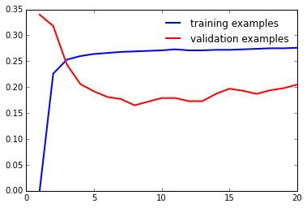
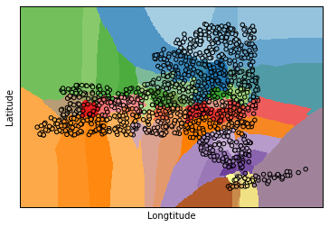
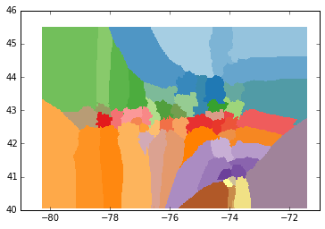

# ADS Homework1

This is the answer for homework 1 extra credit part which uses the k-nearest
neighbor classifier algorithm to classify location data of NY state and beyond.

Here is the image of learning curves in which both training and validation errors are against K value.

Here are the visualization results for the test data by using K = 3.

